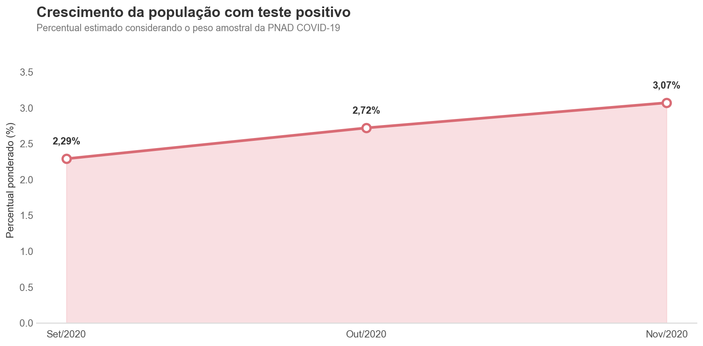
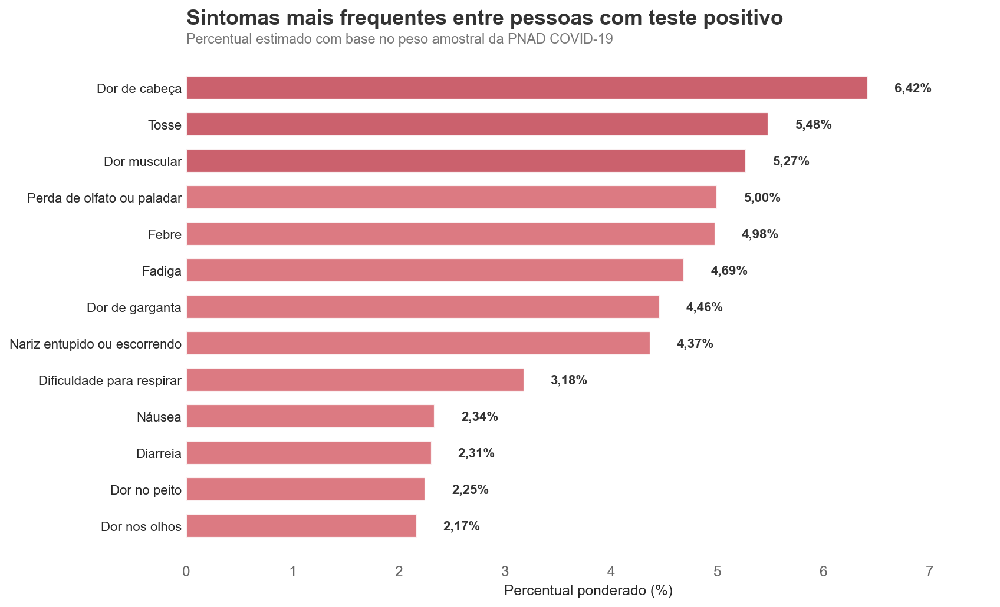
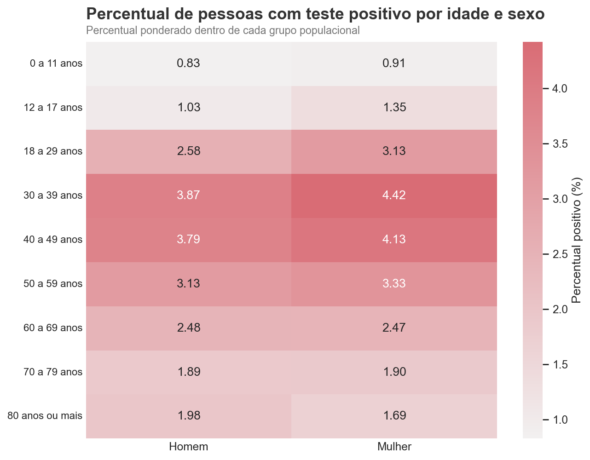
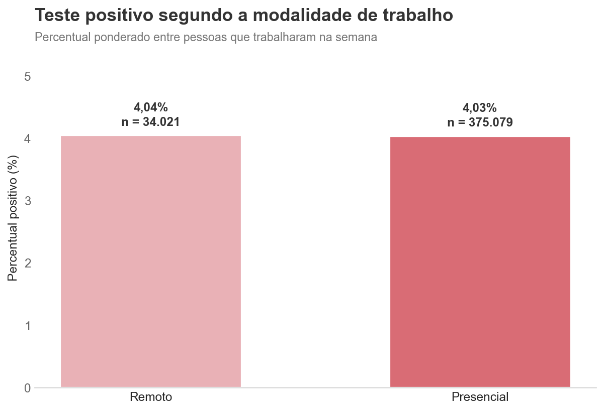
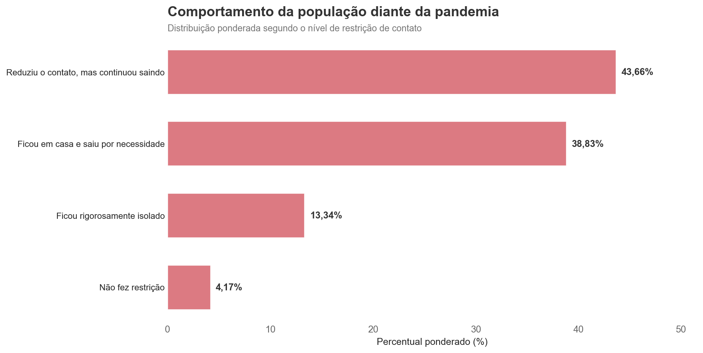
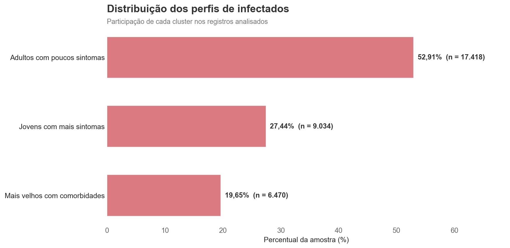
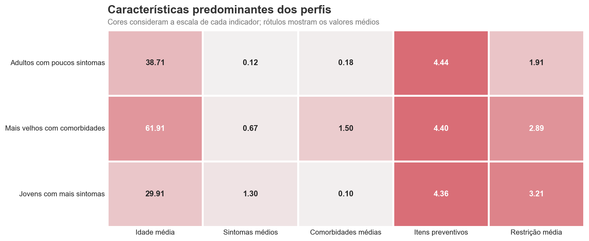
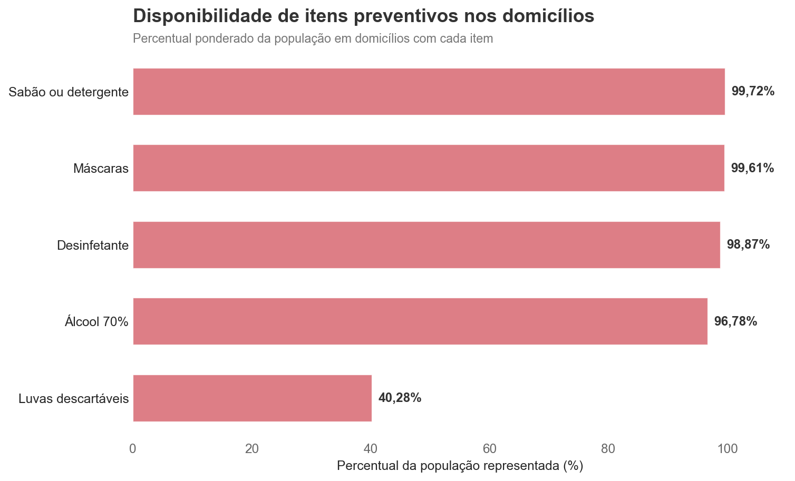
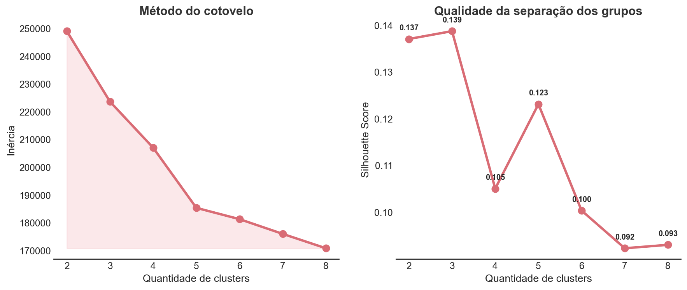
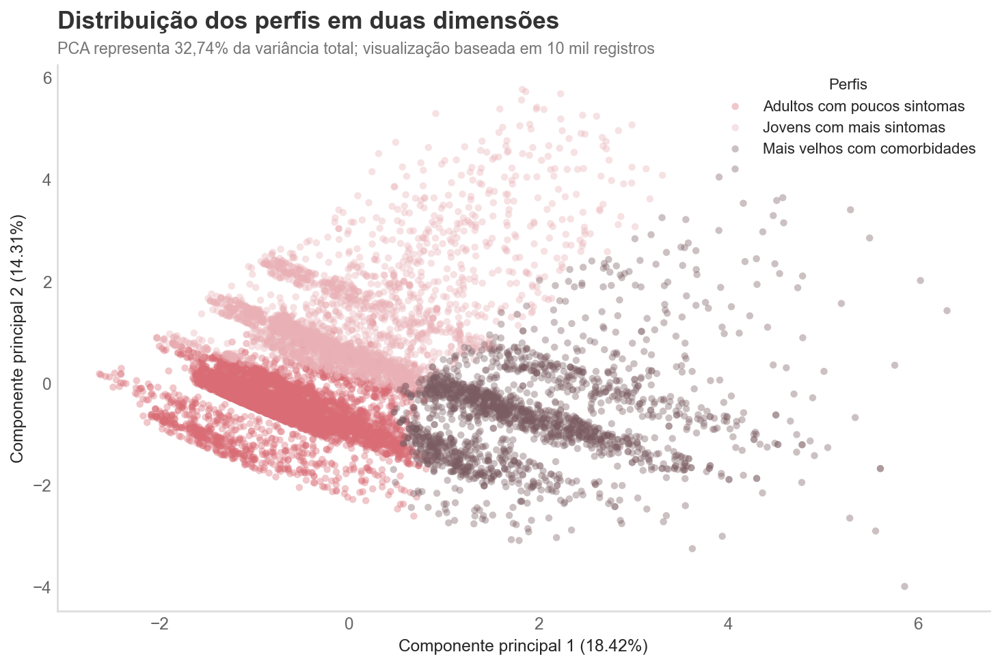

# Análise da PNAD COVID-19

Neste projeto, analisei os microdados da PNAD COVID-19 referentes aos meses de setembro, outubro e novembro de 2020.

O objetivo foi entender a evolução dos testes positivos, os sintomas mais frequentes, os grupos populacionais mais atingidos e alguns aspectos do comportamento da população durante a pandemia. Também utilizei clusterização para identificar perfis entre os registros de pessoas infectadas.

A análise foi desenvolvida com Python e SQL, utilizando PostgreSQL/Supabase para armazenamento e consulta dos dados.

[Ver notebook completo](analise_pnad_covid.ipynb) • [Ver consultas SQL](queries/queries_analiticas_pnad_covid.sql)

## Principais resultados

- O percentual ponderado de testes positivos passou de **2,29% em setembro para 3,07% em novembro**.
- **Dor de cabeça, tosse e dor muscular** foram os sintomas mais frequentes.
- **Mulheres de 30 a 39 anos** apresentaram o maior percentual ponderado de testes positivos: **4,42%**.
- As taxas observadas entre trabalho presencial e remoto ficaram praticamente iguais: **4,03% e 4,04%**.
- A clusterização identificou três perfis entre os **32.922 registros com teste positivo**.

## Evolução dos testes positivos



O percentual ponderado de pessoas com teste positivo aumentou ao longo do período analisado, passando de 2,29% em setembro para 3,07% em novembro de 2020.

Como a base reúne três rodadas mensais, os resultados representam pessoas-mês, e não necessariamente indivíduos únicos acompanhados durante todo o período.

## Sintomas mais frequentes



Dor de cabeça apresentou o maior percentual ponderado, com 6,42%, seguida por tosse, com 5,48%, e dor muscular, com 5,27%.

Esses percentuais consideram os sintomas relatados na semana da entrevista e não apenas os registros com teste positivo.

## Perfil por idade e sexo



Mulheres entre 30 e 39 anos apresentaram o maior percentual ponderado de testes positivos, com 4,42%. Entre os homens, o maior resultado também foi observado nessa faixa etária, com 3,87%.

Os resultados mostram concentração maior entre adultos de 30 a 49 anos, com redução nos grupos mais jovens e nas faixas etárias mais avançadas.

## Trabalho presencial e remoto



As taxas ficaram praticamente iguais entre as duas modalidades:

- **Presencial:** 4,03% — `n = 375.079`
- **Remoto:** 4,04% — `n = 34.021`

A diferença foi de apenas 0,01 ponto percentual. Como os grupos possuem tamanhos diferentes e a análise é observacional, esse resultado não permite afirmar que a modalidade de trabalho causou aumento ou redução dos casos.

## Comportamento da população



A maior parte da população declarou algum nível de redução do contato:

- 43,66% reduziram o contato, mas continuaram saindo;
- 38,83% ficaram em casa e saíram apenas por necessidade;
- 13,34% permaneceram rigorosamente isolados;
- 4,17% não fizeram restrição.

Considerando os pesos da pesquisa, 95,83% das respostas indicaram alguma mudança de comportamento durante a pandemia.

## Clusterização dos registros com teste positivo

A clusterização foi aplicada em 32.922 registros que apresentaram pelo menos um teste positivo.

Utilizei o `MiniBatchKMeans`, uma versão do K-Means adequada para trabalhar com um volume maior de dados. Foram consideradas características demográficas, sintomas, comorbidades, itens preventivos, restrição de contato, região e modalidade de trabalho.

### Perfis encontrados



| Perfil | Participação | Principais características |
|---|---:|---|
| Adultos com poucos sintomas | 52,91% | Idade média de 38,71 anos e baixa quantidade de sintomas e comorbidades |
| Jovens com mais sintomas | 27,44% | Idade média de 29,91 anos e maior média de sintomas |
| Mais velhos com comorbidades | 19,65% | Idade média de 61,91 anos e maior concentração de hipertensão e diabetes |

### Comparação das características



O grupo de adultos com poucos sintomas representa mais da metade da amostra. O segundo perfil reúne pessoas mais jovens, mas com maior quantidade média de sintomas. O terceiro concentra pessoas mais velhas e com maior presença de comorbidades.

A clusterização possui finalidade exploratória: os grupos ajudam a organizar padrões encontrados nos dados, mas não devem ser interpretados como divisões absolutas da população.

<details>
<summary><strong>Ver análises complementares e avaliação do modelo</strong></summary>

### Itens preventivos disponíveis nos domicílios



Sabão, máscaras, desinfetante e álcool 70% estavam presentes na maior parte dos domicílios representados. As luvas descartáveis apresentaram disponibilidade menor.

### Escolha da quantidade de clusters



Foram testadas soluções de dois a oito clusters. A solução com três grupos apresentou o maior `Silhouette Score`, aproximadamente 0,139, e produziu perfis com tamanhos adequados e características interpretáveis.

O valor do Silhouette indica que existe sobreposição entre os grupos. Por isso, os clusters foram utilizados como instrumento exploratório, e não como classificação definitiva.

### Visualização com PCA



O PCA foi utilizado apenas para representar os registros em duas dimensões. Os dois componentes principais explicaram 32,74% da variância total, portanto o gráfico não contém toda a informação utilizada pelo modelo.

</details>

## Etapas do projeto

1. Leitura e consolidação dos microdados mensais;
2. Tratamento e padronização das variáveis;
3. Carga dos dados no PostgreSQL/Supabase;
4. Extração das informações por meio de consultas SQL;
5. Análises descritivas com ponderação amostral;
6. Preparação das variáveis para clusterização;
7. Teste da quantidade de clusters;
8. Treinamento e interpretação do modelo final;
9. Salvamento e validação do modelo.

## Tecnologias utilizadas

- Python
- Pandas e NumPy
- Matplotlib e Seaborn
- Scikit-learn
- SQLAlchemy e Psycopg
- PostgreSQL/Supabase
- Jupyter Notebook

## Estrutura do repositório

```text
pnad-covid-data-analysis/
├── dicionario/
│   └── Dicionario_PNAD_COVID.xlsx
├── imagens/
│   └── gráficos utilizados no README
├── modelo/
│   └── modelo_clusterizacao_pnad_covid.joblib
├── queries/
│   └── queries_analiticas_pnad_covid.sql
├── analise_pnad_covid.ipynb
├── .env.example
├── .gitignore
├── requirements.txt
└── README.md
```

Os microdados não foram publicados no repositório por causa do tamanho dos arquivos.

## Como executar

Clone o repositório:

```bash
git clone https://github.com/LuisFernandoSantana/pnad-covid-data-analysis.git
cd pnad-covid-data-analysis
```

Crie um ambiente virtual:

```bash
python -m venv .venv
```

Instale as dependências:

```bash
pip install -r requirements.txt
```

Baixe os microdados da PNAD COVID-19 e coloque os arquivos abaixo em uma pasta chamada `dados_brutos`:

```text
PNAD_COVID_092020.csv
PNAD_COVID_102020.csv
PNAD_COVID_112020.csv
```

Crie um arquivo `.env` baseado no `.env.example` e preencha as credenciais do PostgreSQL/Supabase. Depois, abra o notebook e execute as células na ordem apresentada.

## Cuidados na interpretação

- Os resultados principais utilizam o peso amostral da PNAD COVID-19.
- A união de vários meses representa pessoas-mês, não indivíduos únicos.
- As análises são descritivas e não demonstram causalidade.
- Os clusters representam padrões exploratórios e possuem sobreposição.
- A representação com PCA preserva apenas parte da variabilidade utilizada pelo modelo.

## Fonte dos dados

Os dados utilizados são provenientes da [PNAD COVID-19, disponibilizada pelo IBGE](https://www.ibge.gov.br/estatisticas/investigacoes-experimentais/estatisticas-experimentais/27946-divulgacao-semanal-pnadcovid1.html).

## Autor

Desenvolvido por [Luis Fernando Santana](https://github.com/LuisFernandoSantana).
